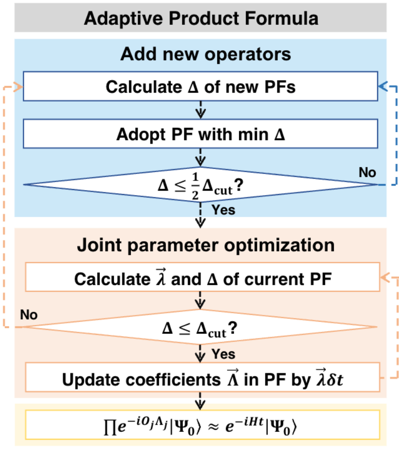
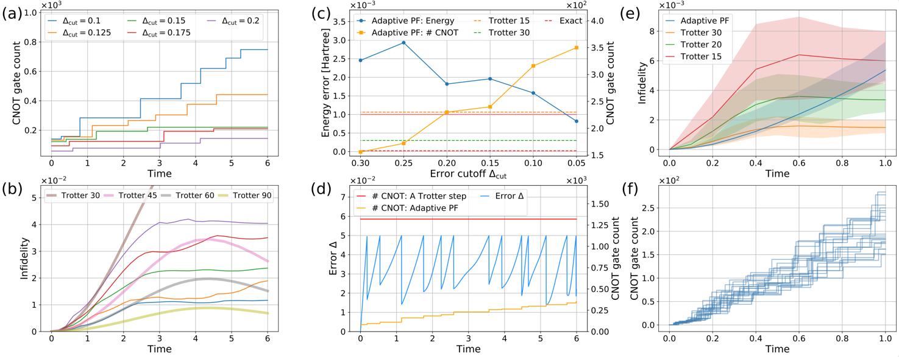

# Adaptive Product Formula

Published as [Phys. Rev. Lett. 130, 040601](https://journals.aps.org/prl/abstract/10.1103/PhysRevLett.130.040601). arXiv: [2011.05283](https://arxiv.org/abs/2011.05283)



## Installation

```bash
git clone https://github.com/doomspec/AdaptivePF
cd AdaptivePF
pip install -r requirements.txt
```

## Usage

The scripts for running the numerical experiments are in the `adaptive_PF` folder.

You can adjust `n_worker` to the number of CPU cores you want to use.

## Results




